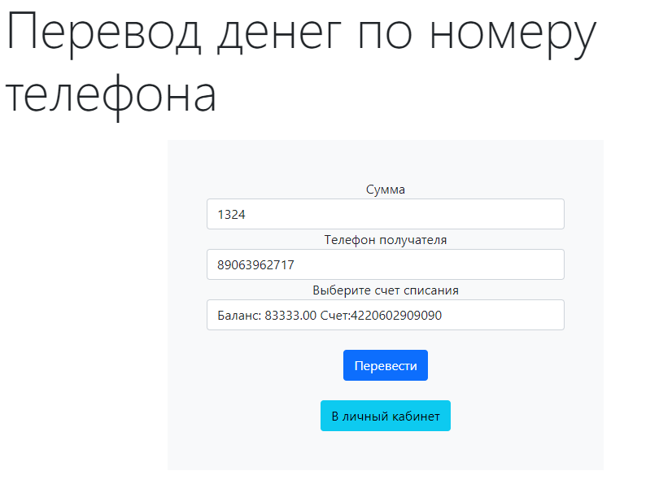

## Выпускная работа по курсу обучения в компании EGAR Technology 
___
### Приложение интернет банк. 
#### Описание:
Клиент может зарегистрироваться в системе. 
Далее открыть счет и пополнить его, может выпустить вирутуальную карту.
Можно открыть вклад. Доступны переводы с карты по номеру карты, либо 
по номеру телефона пользователя со счета. Доступен просмотр истории перемещения финансов.
___
#### Сущности:  
- **Client** - клиент который пользуется приложением
- **User** - сущность которая включается Client также необходима для аккаунтов администратора и технического персонала.
- **CheckingAccount** - простой счет, при открытии первого счета пользователем, этот счет становистя счетом по умолчанию. 
Счет по умолчанию нельзя удалить, так как на него переводятся денежные средства при закрытии накопительных вкладов и обычных счетов.
- **SavingAccount** - накопительный счет, на него начисляются проценты в соответсвии 
с выбранным тарифом. Раз в сутки запускается Scheduler и происходит закрытие вкладов у которых истек 
срок. Проценты начисляются на счет по умолчанию.
- **AccountPlan** - тариф для накопительного счета(банковский продукт) имеет поле процентная ставка, а так же ограничения
на минимальную сумму вклада и период вклада.
- **Card** - виртуальная карта, можно перевести деньги с карты на карту. Включает в себя Account, и по сути средства хранятся
на этом счете.
- **Transaction** - история перемещения денежных средств, имеет поля: время, сумму перевода, а также 
с какого счета и на какой были переведены средства.
- **TransactionStatistics** - сущность отображает статистику использования обычным счетом или картой. Задача которую 
решает эта сущность, это отслеживание частоты использования тем или иным продуктом банка. А так же можно определить нагрузку
на систему по времени. Для реализации применем механизм AOP. В данном случае отслеживается
вызов метода для перевода по карте или по номеру телефона. И тип перевода PHONE или CARD заносится в таблицу.
    

**Диаграмма БД**
  

## Примененные технологии
- Spring boot
- Java collection framework, Java Stream API
- Spring data JPA, Hibernate
- Валидация средствами spring (jsr303)
- AOP
- Docker compose
- Spring security(для удобства тестировани REST API оставлен открытым, MVC закрыт)

## Запуск:
>склонировать репозиторий
 
> запустить приложение через IDE или другим удобным способом, данном случае необходимо настроить пользователя и пароль
> от БД в файле application.properties

или 
>запустить файл docker-compose.yml, предварительно выполнить команды mvn clear package, в данном случае
> пользвателя и пароль от БД настраивать не нужно, к базе данных можно подключиться на порту 5433
  

>Выполнить скрипт dump-bank_egar-202207102151.sql в БД.

по умолчанию приложение запускается на порту 8080

## Пример работы
REST-API можно протестировать на странице swagger по ссылке ниже, если при запуске выбран другой порт
то отредактировать его в ссылке
http://localhost:8080/swagger-ui.html
**Ниже приведу скриншоты работы приложения**  
Страница приветствия  

Панель регистрации пользователя

Личный кабинет клиента

Страница открытия вклада, производится проверка что 
данные удовлетворяют условиям вклада

Форма пополнения счета, тут деньги беруться из воздуха)

Страница с вкладами, видно какая сумма накопилась

Можно первести деньги по номеру другому клиенту

Страница со списком выпущеных карт

Есть небольшая панель администратора, через которую можно добавить банковские предложения

Так же есть и другие страницы приложения.
Остаальную функциональность приложения предполагается использовать через REST

Спасибо за внимание!